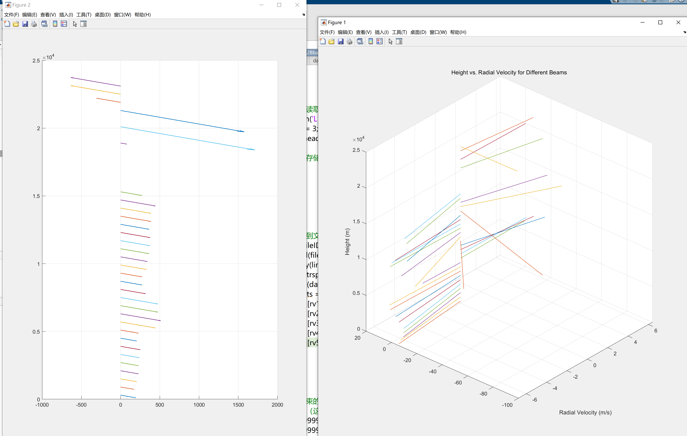

# 7.22 todo

- [X] L2数据绘图

2. L1B->L2 解决误差，转换公式在文档里

# 7.26

## 本周工作总结

1. 学习了matlab的基本知识，初步掌握了matlab的文本处理与绘图功能
2. 实现了L1B和L2数据绘图功能

中间的部分考虑断开？还是另一张图展示

3. 实现了L1B数据的基础优化，实现数据筛选

4. 实现了从L1B到L2的部分数据的转化（因数据缺失尚未转化完成）
## 这阶段尚未完成的内容
1. 进一步学习matlab的其他功能
2. 争取实现数据可视化的形式更多样
3. 进一步优化数据筛选算法，提高数据质量
4. 继续完成L1B到L2的数据转化
## 目前遇到的问题
1. 部分数据缺失（功率值、频率值）
2. 如何优化数据的可视化，使图像更易于理解

# 7.26号阶段性总结
1. 需要更多的算法实现数据筛选，以适应更多不同类型的数据
2. 数据转化模块，需要进一步实现
3. 绘图功能增强。实现动态图（需要前端）

# 8.12号to do
- [x] 批处理数据代码
- [ ] 数据转化代码(算角度的公式)
- [x] 填充数据（根据高度和相对）
- 更多可视化方式
  
1. 前端网页架构.（联系工程师）

# 8.13 小结
需要交流的内容：
1. 数据转化的具体公式
2. 寻求更多图列样式
3. 工程师联系方式（网页部分）（三维部分归属）
4. 6、7月数据